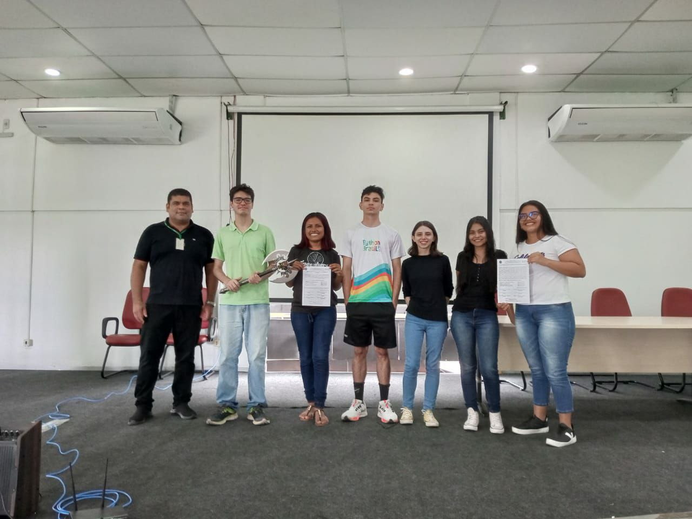

<h2> Centro Academico - Engenharia de Software - IFAM Campus Zona Leste </h2>

A nossa chapa tem objetivos bem simples e definidos: 

1. Atender as principais demandas das turmas de Engenharia. 
2. Prover as melhorias das atividades acadêmicas. 
3. Fomentar maior participação dos discentes na vida acadêmica. 

O C.A.E.S. do IFAM-CMZL elaborou propostas dentro da realidade vivida pelos alunos e que contemplam nossos interesses frente ao Instituto. Assim, estruturamos nossa gestão buscando contemplar as áreas de Tecnologia, Finanças, Eventos, Comunicação e Cultura e Lazer.

### Compromissos na área de Tecnologia:

1. Fiscalizar e colaborar na reformulação do PPC do curso, auxiliando a coordenação e representando os discentes de forma ativa e responsiva;

2. Atualizar o estatuto do Centro Acadêmico;

3. Incentivar estudante a adentrarem atividades de pesquisa e extensão por meio de conexões com professores através de áreas de interesse em comum, bem como a participação em eventos extracurriculares: hackathons, summer jobs, workshops, code jamms, competições, etc.

### Compromissos na área de Finanças:

1. Prestar Contas das doações e custos do C.A.</li>

2. Prover eventos que possibilitem arrecadar fundos á organização de eventos, melhorias no ambiente do centro acadêmico e eventuais gastos. Dentre as atividades propostas, estão: organização de cantinas, vaquinhas colaborativas, solicitar recursos junto à Lei da Informática da ZFM, etc.

### Compromissos na área de Comunicação:

1. Articular parceiras com outros Centros Acadêmicos do IFAM para realização de atividades conjuntas e cobrança de interesses estudantis, como sobre os serviços prestados pelo Instituto;

2. Divulgar informes com mais frequência em diversos canais de comunicação (Instagram, WhatsApp, Facebook e Twitter) sobre os processos e articulações do nosso C.A.;

3. Participar ativamente em redes sociais, compartilhando todas as realizações relevantes do CAES-IFAM-CMZL;

4. Divulgar vagas de estágio com empresas interessadas nos alunos do curso (e de possíveis vagas que possam ser de interesse dos estudantes).

### Últimas postagens:

<ul>
  <li><a href="./posts/mes02-fevereiro/post01-posse-ca.md"> Posse da Chapa </a></li>
</ul>

<h4> Nos Acompanhe nas Redes: </h4>

&nbsp; 
&nbsp; 
&nbsp; 
&nbsp; 

 &copy; @CarlosViniMSouza - Desenvolvido com <del>Next.js</del> Markdown 

 Site em construção ... ⚠️

